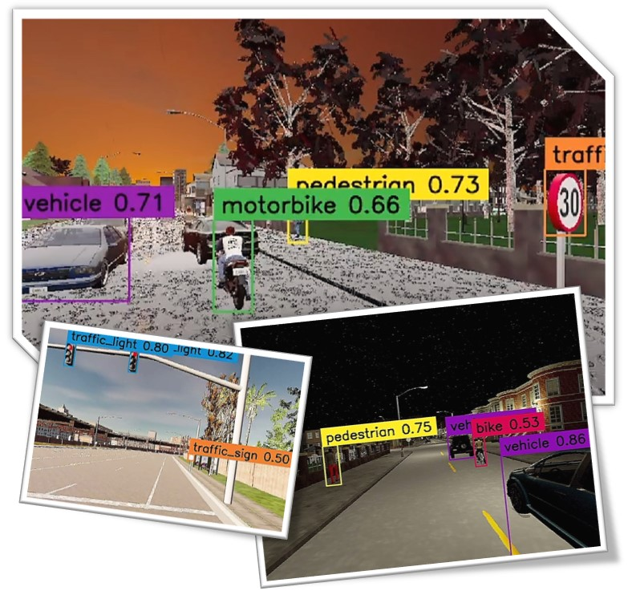
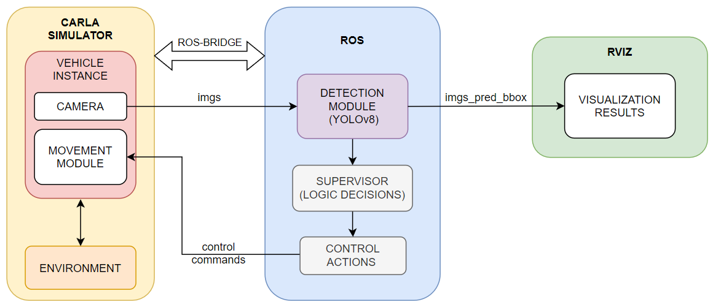
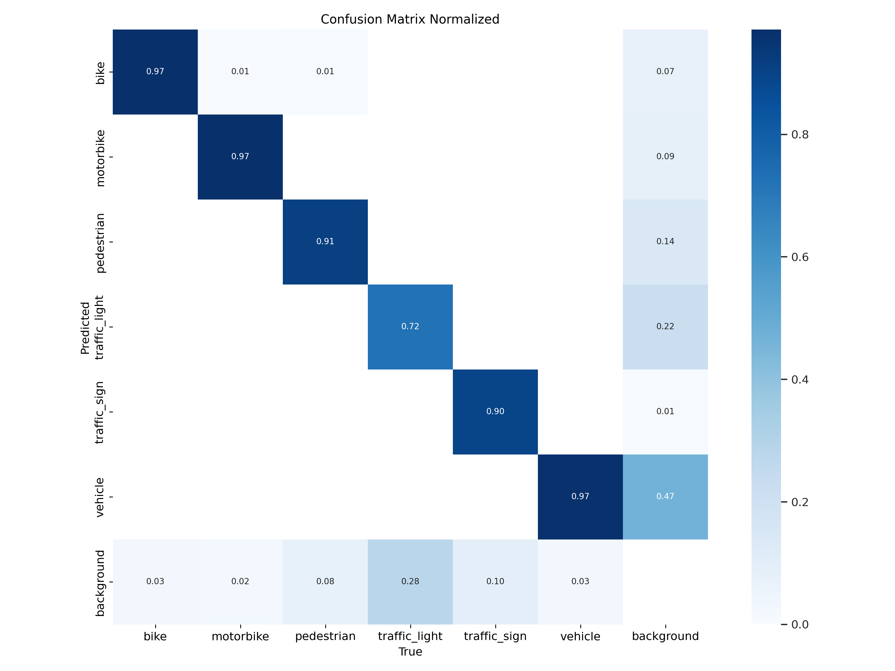
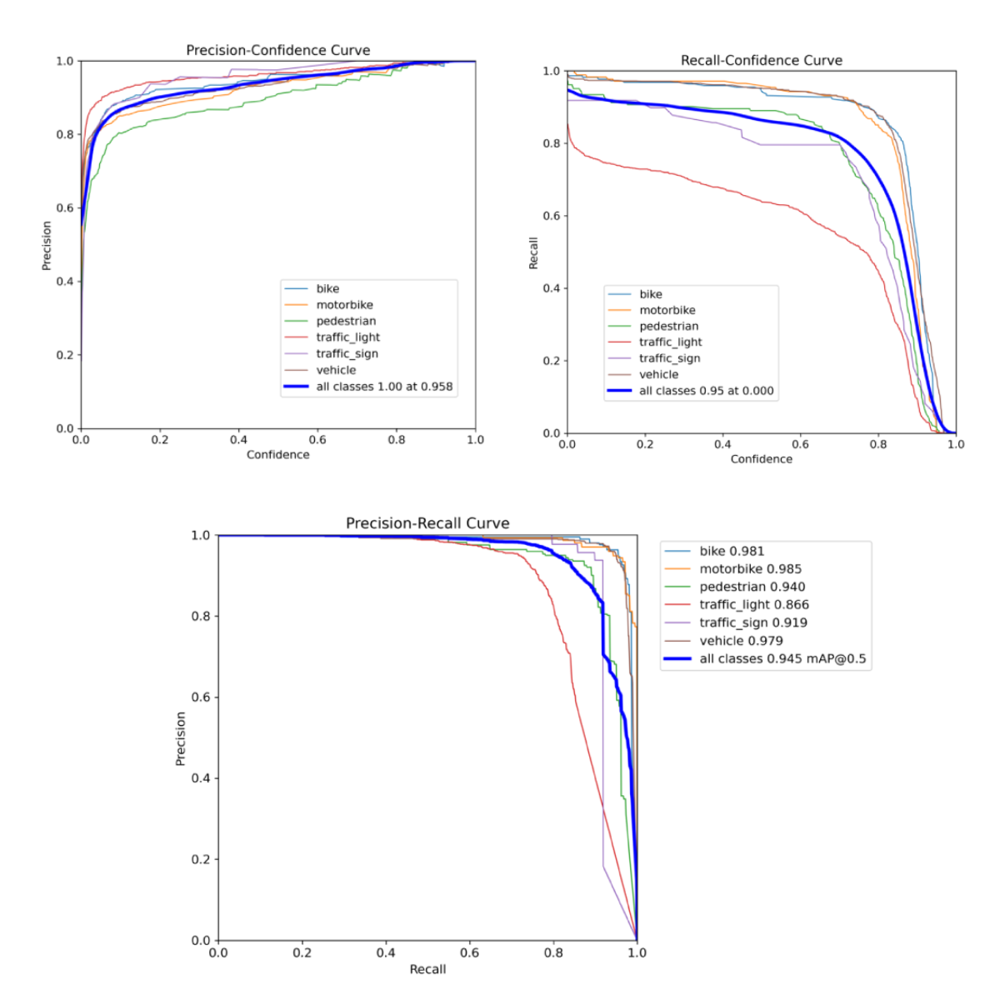
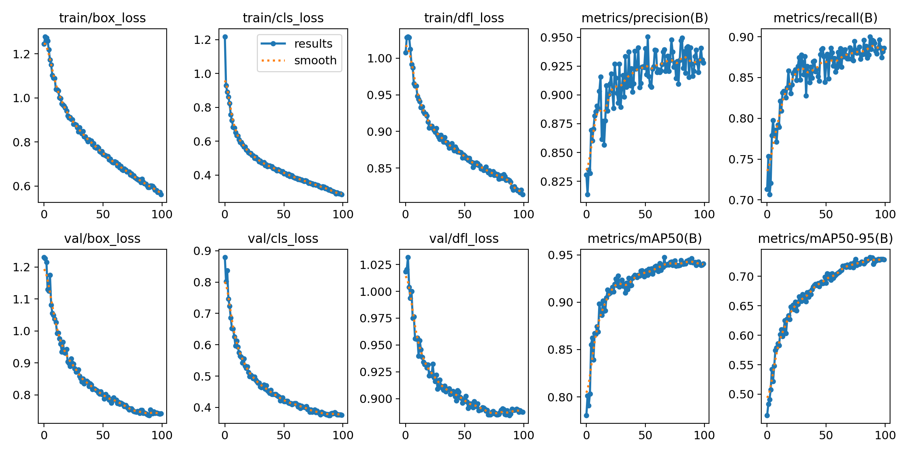
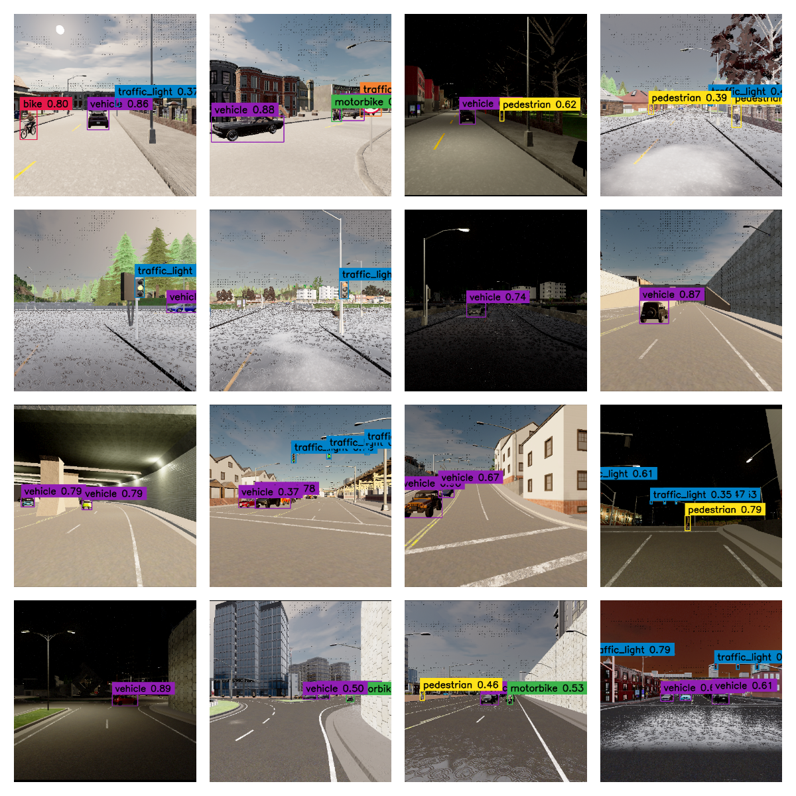
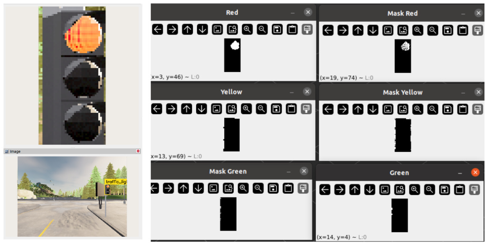

## IntelliCar
#### Application of Computer Vision Techniques for Object Detection and Recognition in Urban Environment Simulation oriented to Autonomous Driving Vehicles
---
##### INTRODUCTION
This project is focus on image object detection by training a model using YOLO. Simulations are done on CARLA Simulator and a integration with ROS has been developed.

##### TOOLS

+ **Dataset**: We create our custom dataset, using Roboflow Platform, by the integration of some existing datasets and the addition of multiple images of scenarios with different environmental and weather conditions.
[Dataset on Roboflow Platform](https://universe.roboflow.com/carla-awmfg/carladataset/model/5)

+ **Simulator**: We use the open-source simulator for autonomous driving systems CARLA.
[CARLA web page](https://carla.org/)
[CARLA Github](https://github.com/carla-simulator/carla)

+ **Model Training**: Model based on newest version of YOLO (YOLOv8) from Ultralytics. 
[YOLOv8 Github](https://github.com/ultralytics/ultralytics)

+ **ROS**: Running model inference for prediction and extra decission tasks modules.

+ **ROS-Bridge**: CARLA - ROS communication.
[ROS-Bridge Github](https://github.com/carla-simulator/ros-bridge)

---
##### MODEL PERFORMANCE:

---
##### EXPERIMENTS RESULTS:

##### TRAFFIC LIGHT STATE AND EMERGENCY BRAKE SUPERVISOR

---
##### PROJECT REPORT:
More info about the project can be found on Memory.pdf

##### FUNCTIONAL VIDEO: 

